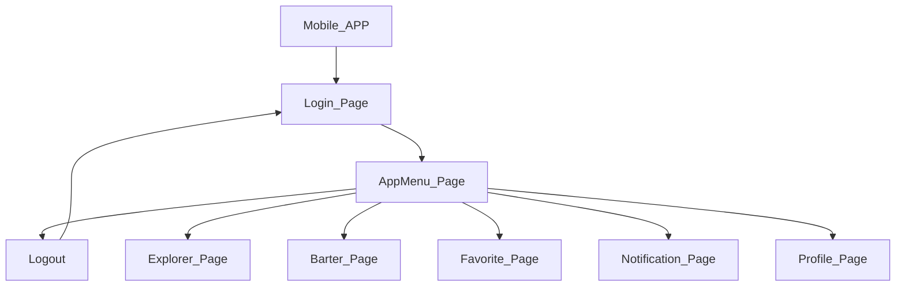

# Trueke App .NET Core 8

### Projects
* [Requirement](https://github.com/TheNefelin/Kambio_.NetCore/tree/master/Requerimiento)
* [.NET 7 - Class Library Client](https://github.com/TheNefelin/Kambio_.NetCore/tree/master/ClassLibraryClient)
* [.NET 7 - Class Library Models](https://github.com/TheNefelin/Kambio_.NetCore/tree/master/ClassLibraryModels)
* [.NET 7 - Class Library Server](https://github.com/TheNefelin/Kambio_.NetCore/tree/master/ClassLibraryServer)
* [.NET 8 - Mobil App](https://github.com/TheNefelin/Kambio_.NetCore/tree/master/MauiKambio)
* [.NET 8 - Web API](https://github.com/TheNefelin/Kambio_.NetCore/tree/master/WebApi)
* [.NET 7 - Web Api Test](https://github.com/TheNefelin/Kambio_.NetCore/tree/master/WebApiTest)

## App

## View

    
    &nbsp;
    
    &nbsp;
    
    &nbsp;
    
    &nbsp;
    
    &nbsp;    

