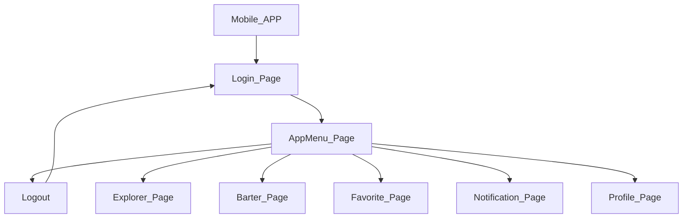

# Trueke App .NET Core 8

### Projects
* [Mobil App](https://github.com/TheNefelin/Kambio_.NetCore/tree/master/MauiKambio)
* [Web API](*)
* [Class Library](https://github.com/TheNefelin/Kambio_.NetCore/tree/master/ClassLibraryModels)
* [Requirement](https://github.com/TheNefelin/Kambio_.NetCore/tree/master/Requerimiento)

## App

## View
&nbsp;

&nbsp;

    &nbsp;
    
    &nbsp;
    
    &nbsp;
    
    &nbsp;
    
    &nbsp;
    
    &nbsp;	

